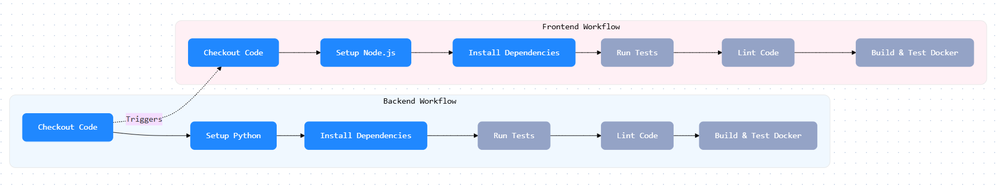
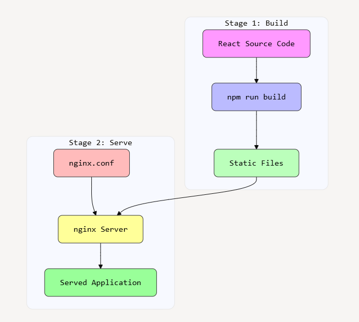

# azure-hackathon-test
# frontend
```bash
npx create-react-router@latest frontend
cd frontend
npm i
npm run dev
```

### Random notes
Your frontend workflow triggers on changes to 'todo-application/frontend/**'

Your backend workflow triggers on changes to 'todo-application/backend/**'

# Resources
https://reactrouter.com/start/modes





Your project follows a clean, modern architecture with clear separation of concerns:

Backend Structure
Python Flask application with comprehensive test suite
Well-organized test structure covering:
Unit tests (test_app.py)
Integration tests (test_integration.py)
Model tests (test_models.py)
Route tests (test_routes.py)
Dockerfile for containerization
Frontend Structure
Modern React application with TypeScript
Component-based architecture
Route management with react-router
Dockerfile for containerization
CI/CD Integration
GitHub Actions workflows for both frontend and backend
Automated testing and deployment pipeline

